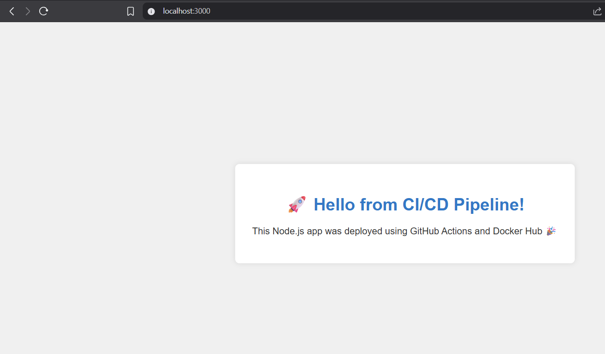

# 🚀 Node.js CI/CD Pipeline

**Repository:** [anagha7/nodejs-cicd-devops](https://github.com/anagha7/nodejs-cicd-devops)  
**Author:** Anagha P Ajit

---

## 📌 Overview

This project showcases a fully automated **CI/CD pipeline** for a Node.js Express application using **GitHub Actions** and **Docker Hub**. Every code push to the `main` branch triggers a workflow that:

- Installs dependencies
- Runs tests
- Builds a Docker image
- Pushes it to Docker Hub

This setup reflects practical DevOps skills and demonstrates real-world deployment automation.

---

## 🛠️ Tech Stack

| Tool/Platform    | Purpose                          |
|------------------|----------------------------------|
| Node.js + Express | Web server / application         |
| GitHub Actions    | CI/CD automation                 |
| Docker            | Containerization                 |
| Docker Hub        | Container registry               |
| GitHub Secrets    | Secure credential management     |

---

## ⚙️ How It Works

1. **Edit Code** → Make changes in your local repo
2. **Push to `main`** → Triggers GitHub Actions workflow
3. **Workflow runs:**
   - Checks out the repo
   - Sets up Node.js
   - Installs dependencies
   - Runs tests
   - Builds Docker image
   - Pushes image to Docker Hub
4. **Pull and run the container locally or on any server**

---

## 🧪 Local Setup (To Run the Latest Build)

```bash
# Pull image from Docker Hub
docker pull anagha7/nodejs-cicd-devops:latest

# Run it on port 3000
docker run -p 3000:3000 anagha7/nodejs-cicd-devops:latest
````

Visit: [http://localhost:3000](http://localhost:3000)

---

## 📁 Project Structure

```

nodejs-cicd-DevopsTask1/
├── index.js                 # Main Node.js server file
├── package.json             # Project config (auto-created by npm)
├── Dockerfile               # Docker instructions to build the app
├── .dockerignore            # Ignore files during Docker build
├── .github/
│   └── workflows/
│       └── main.yml         # GitHub Actions CI/CD pipeline
├── README.md                # Task documentation and walkthrough
└── node\_modules/            # Installed dependencies (auto-created)

```
---



---

## 🔒 Secrets Configuration (CI/CD Security)

* **DOCKER\_USERNAME** → Your Docker Hub username
* **DOCKER\_PASSWORD** → Your Docker Hub personal access token
  Stored securely under GitHub repo → Settings → Secrets → Actions.

---

## 🧠 What I Learned

* Setting up a complete CI/CD pipeline from scratch
* Writing production-ready GitHub Actions workflows
* Building and pushing Docker images automatically
* Debugging container issues and build context errors
* Using secrets to protect sensitive credentials

---

## 📚 Internship Task Checklist

* [x] GitHub Actions workflow configured
* [x] Dockerfile and .dockerignore added
* [x] GitHub Secrets for secure Docker Hub login
* [x] Docker image built and pushed on code push
* [x] Web app accessible on `localhost:3000`
* [x] README with clear documentation and screenshot 

---

This repository demonstrates my ability to apply DevOps principles in a practical setting—handling automation, containerization, and secure deployment pipelines. I'm excited to contribute these skills to your team!

---
